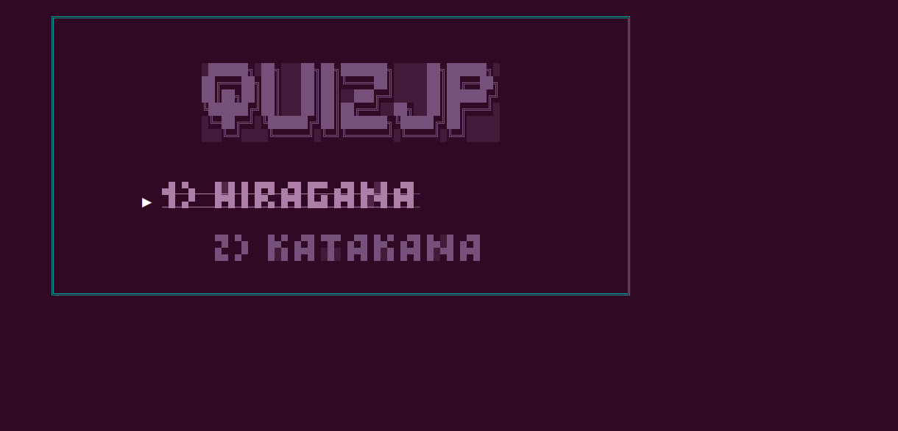
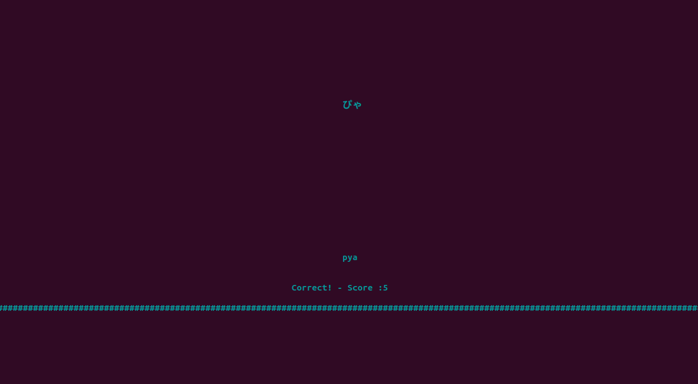

# QUIZJP

This software allows you to practice Japanese hiragana and katakana.
This program is written in C language and deals with file manipulation.

## About

This program compares the input written by the user with the answer written in the txt file from a certain japanese character.
The questions are generated randomly.


 ## Syncing a Forked Repository on github


Syncing a forked repository to keep it up-to-date with the upstream repository.


```
git remote add upstream https://github.com/joaocasr/quizJP.git
git fetch upstream
git checkout main
git merge upstream/main
```

  ## How to Install

```
git clone https://github.com/joaocasr/quizJP.git
cd quizJP/
make
./test
```
  ## Menu
  This is the current state of the menu. Here you can select the different kind of quiz you want.
  For now it's only available the hiragana and katakana quiz. Soon I will add new features.
    


  ## Hiragana Quiz
  Here you can see some of the functionalities of the software, such as the pontuation register.
  The goal is to write the correct romaji for a certain hiragana/katakana showed in the screen.
  How many points did you get? 
  


  ## TO-DO
 
  * Kanji test
