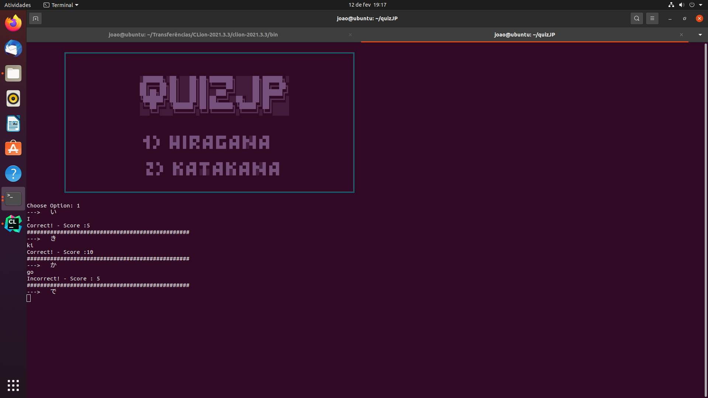

# QUIZJP

This software allows you to practice Japanese hiragana and katakana.
This program is written in C language and deals with file handling.

## About

This program compares the input written by the user with the answer written in the txt file from a certain japanese character.
The questions are generated randomly.


 ## Syncing a Forked Repository on github


Syncing a forked repository to keep it up-to-date with the upstream repository.


```
git remote add upstream https://github.com/joaocasr/quizJP.git
git fetch upstream
git checkout main
git merge upstream/main
```

  ## How to Install

```
git clone https://github.com/joaocasr/quizJP.git
cd quizJP/
make
./test
```
  ## TO-DO
 
  * Kanki test
  * Better interface

  ## Interface
 
  

